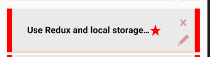

# React-Native ToDoApp with Redux
Week 2 React Native Project

## To mark important tasks
Long press at the panel  

## To mark as done
Press on the text  
.png)

## To display full text (ellipsize text)
Press at the panel  
.png)
.PNG)

## Sample Output

